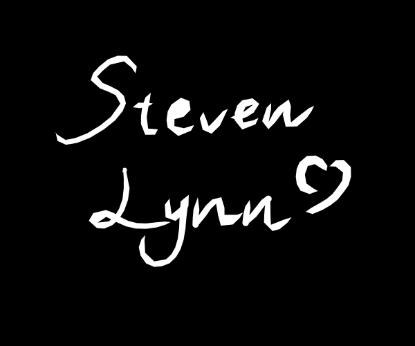

# Hi!👋 I'm Steven Lynn!

## I am
- User of [@Dify](https://github.com/langgenius)
- AI illustrator/researcher
- Building [@Twi.AM](https://github.com/stvlynn/twi.am) [@AI Tweet](https://x.com/AITweet_app)
- Co-founder & ex-editor of AI Pulse

## My LLMs on 🤗HuggingFace

- [Reflection-Chinese-32B](https://huggingface.co/stvlynn/Reflection-Chinese-32B)

- [Gemma-2-2b-Chinese-it](https://huggingface.co/stvlynn/Gemma-2-2b-Chinese-it)

- [Qwen-7B-Chat-Cantonese](https://huggingface.co/stvlynn/Qwen-7B-Chat-Cantonese)

## Languages

Chinese/English/Japanese

## 💻 Technology stack

### Learning

### Using

### Tools

### Systems

## Contacts

<a href="#" class="button icon arrowdown"><a href="https://stv.lol">More</a></a>

## 📊 Contributions

<picture>
  <source media="(prefers-color-scheme: dark)" srcset="assets/github-contribution-grid-snake-dark.svg" />
  <source media="(prefers-color-scheme: light)" srcset="assets/github-contribution-grid-snake.svg" />
  
</picture>

## Thanks for visiting!

